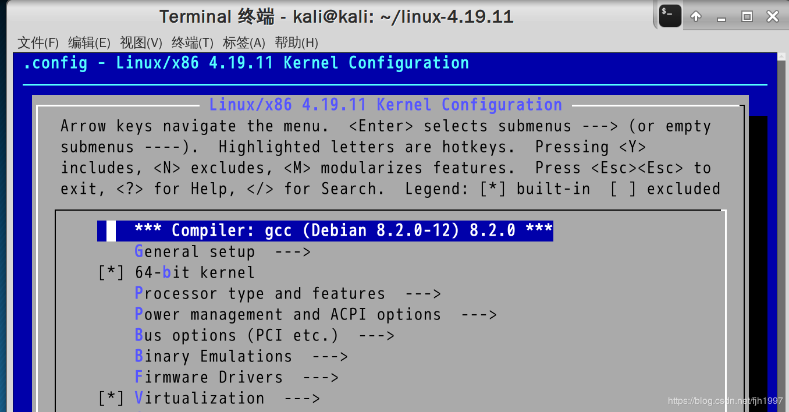
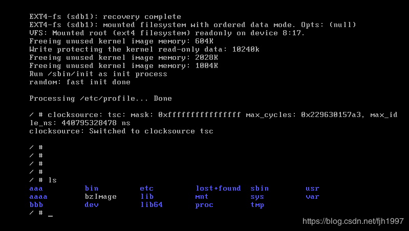
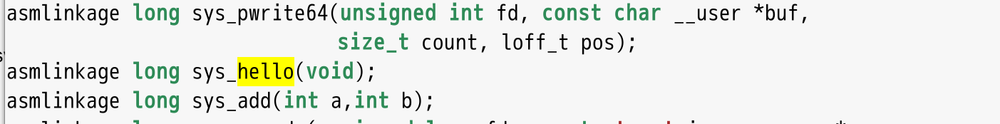
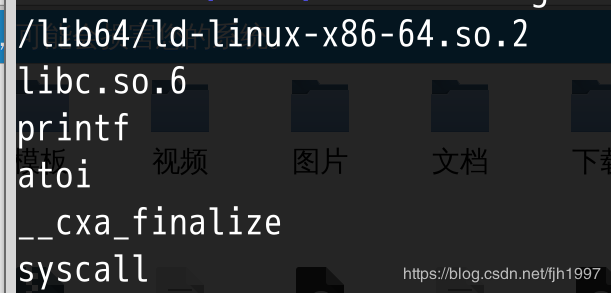
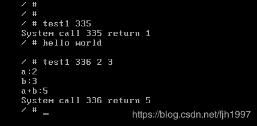

# Make minimal Operation System with customized system call function based on linux4.19.11 kernel source in VMware Workstation（env：kali-4.18）


Recently ，I take a Course Design in school，detailed below：

1. Write a response function for the new system call. The name and function of the function are defined by the experimenter. Embed the new system call function into the Linux kernel

2. write an application to test new system calls and output test results

To achieve the above design tasks, you must compile a kernel specialized for  Course Design. However, to compile the kernel requires some configuration,let’s have a look：


## Step one，Download linux4.19.11 kernel source and extract files：

```
wget https://cdn.kernel.org/pub/linux/kernel/v4.x/linux-4.19.11.tar.xz
xz -d linux-4.19.11.tar.xz
tar -xvf  linux-4.19.11.tar
cd linux-4.19.11
```


## Step two, Install dependency and run GUI config menu:

```
sudo apt install libncurses5-dev libssl-dev 
sudo apt install build-essential openssl 
sudo apt install zlibc minizip 
sudo apt install libidn11-dev libidn11
sudo apt install bison flex
make menuconfig
```
Some time is needed during compilation , If any error occurs , the reason is the lack of some dependency, use apt to install them.
## Step three，Let’s see the config menu


&#8195;  Be ware，the default configuration in GUI menu is automatically generated by the configure file of current kali system.  So, the features  of the default configuration is between the configuration generated by command *make allyesconfig* and *make allnoconfig*.If compiled with the default configuration ，the size of system kernel is about 300M\~400M. And compiling time is 6h+ ,not to mention  *make allyesconfig* .Clearly, It’s not good for compilation and debugging. If you follow configuration generated by command *make allnoconfig*, then, it would be compiled about 1~2 minutes, and the system kernel is only 500k, but many functions are not used, obviously unrealistic.so you have to constantly remove and add the features according to your own needs . The easiest way is to continuously cut the function based on the current system’s configuration until it can no longer be reduced (the purpose is to enable the system kernel's verbose error function, output the boot log for subsequent debugging, if you start *make allnoconfig* at the beginning, although the system is the smallest, but A lot of features is not enabled，it is better to use the original system default configuration, and then  delete item one by one.). For example, if the boot log encounters error */bin/sh exists but can't execute*, it means that the execution  of executable file encounters a problem. You need to enable the *kernel support for elf binaries* in the *excutable file format* and start the *64bit kernel*. Something need to be explaind that the customized kernel may cause conflicts in the same partition as the distribution kernel, so the customized kernel needs to be installed in another partition. If you encounter the problem of can't udev, it means that the daemon udev is not open or the harddisk driver is not installed, you need to install the corresponding hard drive, the steps are as follows: Type 'modinfo mptbase' and  prompt for the following information:

```
root@kali:/home/kali/linux-4.19.11# modinfo mptbase
filename:       /lib/modules/4.18.0-kali2-amd64/kernel/drivers/message/fusion/mptbase.ko
version:        3.04.20
license:        GPL
description:    Fusion MPT base driver
author:         LSI Corporation
srcversion:     AE14687F5D92F8703B5805F
depends:        
retpoline:      Y
intree:         Y
name:           mptbase
vermagic:       4.18.0-kali2-amd64 SMP mod_unload modversions 
parm:           mpt_msi_enable_spi: Enable MSI Support for SPI controllers (default=0) (int)
parm:           mpt_msi_enable_fc: Enable MSI Support for FC controllers (default=0) (int)
parm:           mpt_msi_enable_sas: Enable MSI Support for SAS controllers (default=0) (int)
parm:           mpt_channel_mapping: Mapping id's to channels (default=0) (int)
parm:           mpt_debug_level: debug level - refer to mptdebug.h - (default=0)
parm:           mpt_fwfault_debug:Enable detection of Firmware fault and halt Firmware on fault - (default=0) (int)
```
It seems the harddisk driver is *Fusion MPT base driver*

Configure PCI bus driver, select in turn "Bus Option"-"Pci support":


The detail prompted shows my harddisk is SCSI type，So Scsi is truly needed，select in turn as "Device Drivers"-"Scsi device support"--"Scsi device support","Scsi disk support"


Scsi disks require a Sata controller. This step is more critical. Select the appropriate driver from the controller drivers of different vendors.
According to the  prompt detail above .My virtual machine uses *Fusion LSI harddisk driver*,so select in turn:
1)"Device Driver"-"Serial ATA and Parallel ATA driver"-"AHCI SATA support";
2)"Device Driver"-"Fusion MPT device support"-"Fusion MPT ScsiHost driver for SPI";

3)"Device Driver"-"Scsi device support"-"SCSI low-level drivers"-"LSI MPT Fusion SAS 2.0 Device Driver"


After the device driver is configured, you need to configure the file system and ELF file format supported by the kernel. For the sake of convenience, we do not set the kernel support initramfs, directly use the bootup of busybox.


Select "File Systems"-"The Extend 4(ext4) filesystem"


Select"Executable file formats"-"kernel support for ELF binaries"

"Kernel support for scripts starting with #!"

Other setting ：


```
[*]64 bit kernel

Processor type and features --->

Processor family () --->

[*] Generuc x86 support

Bus options (PCI etc.) --->

[*] PCI support

PCI access mode (Any) --->

Executable file formats / Emulations --->

[*] Kernel support for ELF binaries

[*] Write ELF core dumps with partial segments

[*] Enable the block layer #This is very important ，or you can't enable SCSI

Device Drivers  --->

[*] Block devices --->

<*> Loopback device support

SCSI device support --->

<*> SCSI device support

[*] legacy /proc/scsi/ support (NEW)

<*> SCSI disk support

input device support--->

[*]Generic input interface

[*]event interface

[*]event debugging

***** Input Device Drivers****

[*]keyboards----->

[*]AT keyboard

[*]……keyboard   #All keyboard dirver could be selected

Hardware I/O Ports--->   

[*]Serial I/O support

……             # All of these could be selected
[*]character devices --->

[*]enable tty

[*] Fusion MPT device support --->

<*> Fusion MPT ScsiHost drivers for SPI

<*> Fusion MPT ScsiHost drivers for FC

<*> Fusion MPT ScsiHost drivers for SAS

<*> Fusion MPT misc device (ioctl) driver

File systems  --->

[*]   The extended 4(ext4) filesystem

[*]   Use ext4 for ext2 filesystem

[*]     Ext4 POSIX Access Control Lists 

[*]     Ext4 Security Labels

[*]     Ext4 Encryption 

 
After the setup is complete, select Save, name it '.config', then choose Exit to exit.


 ```

## Step four、Compile kernel in origin system

The time is not long, about five or six minutes (provided that you have symplified the configration), the system is compiled with about 2M size


```
make clean
make bzImage -j4
```


## Step Six、Add hard disk and make partition

Add a 500MB SCSI hard disk to vmware and execute the command after rebooting:

	fdisk -l
You can see the /dev/sdb device 
Then make partition

	fdisk /dev/sdb
Input n and make partition /dev/sdb1
formatting

	mkfs -t ext4 /dev/sdb1
Mount partition

	mount /dev/sdb1 /mnt
Compile busybox
```
wget https://busybox.net/downloads/busybox-1.29.3.tar.bz2
tar xvf busybox-1.29.3.tar.bz2
cd busybox-1.29.3
make menuconfig
```
Below are the options that need to be compiled into the busybox:

Option need to be selected in General Configuration:

Don't use /usr

&#8195;  
This option must be selected, otherwise the makebox will be installed in the original system /usr after make install, which will overwrite the original system commands.

Build Options

Build BusyBox as a static binary (no shared libs)

&#8195; This option  also  must be chosen, in order to compile busybox into a statically linked executable file, then the runtime is independent to other libraries. Otherwise, other library files must be linked to make it run, and a single Linux kernel cannot make it work properly.


Other options are some of the basic Linux command options. You could choose the commands according to your own needs . Generally, you can use the default ones. After configuration, exit and save.


Compile and install busybox

```
make
make install 

```
After make install, a directory called _install will be generated in the busybox directory, which contains the busybox and the links to it.


```
cp _install/* /mnt/           #Copy all the files under _install to sdb1 
rm -f /mnt/linuxrc  
cp -r ./examples/bootfloppy/etc /mnt       #Copy the configuration file under etc to sdb1 
cd /mnt/  
mkdir proc mnt usr var tmp dev sys         #Create a directory 
cp -a /dev/{console,tty,tty2} dev/    #Copy the device files of the original system to the customized system
mkdir dev/input
cp -r /dev/input/* dev/input/
cp /root/linux-4.19.11/arch/x86/boot/bzImage /mnt/bzImage #copy kernel
```


## Step seven、update grub

Open grub configuration files

	vi /etc/grub.d/40_custom #The number may be different  for different systems
	Add the following information at the end
	
```
menuentry "My Linux-4.19.11" {
 
insmod ext2 #ext2 covers ext3、ext4
 
set root='(hd1,1)'
 
linux /bzImage ro root=/dev/sdb1
 
}
```
Update grub

	update-grub
Restart the system, select My Linux-4.19.11 in the grub menu. If you see the following interface, the kernel is successfully compiled.



## Step eight、Add system call

Back to the original system, change the Linux source code in the following file:


	vi /root/linux-4.19.11/arch/x86/entry/syscalls/syscall_64.tbl
	

Add the following two system calls, note that the form of the two system calls is not the same, the latter form is mainly for the purpose of passing the parameters, as will be discussed later.


Edit head file，Add the following two function prototype:

	vi /root/linux-4.19.11/include/linux/syscall.h

Edit sys.c source file，Add the following two function difinition:

	vi /root/linux-4.19.11/kernel/sys.c

```
long sys_hello(void)
{
printk("hello world");
return 1;
}
SYSCALL_DEFINE2(add,int,a,int,b)
{
printk("a:%d \n",a);
printk("b:%d \n",b);
printk("a+b:%d \n",a+b);
return a+b;
}
```

Note that the above function definitions are different. The former is defined directly, the latter is defined by macros, and then sys_add is automatically replaced by the compiler as __x64_sys_add. The purpose is to let the system call implement the parameters, which is equivalent to an interface. SYSCALL_DEFINE2 means that there are two parameters, int a, int b.
Then recompile the kernel and copy it to the new hard drive.
## Step nine、write a test program
The purpose is to manually implement the system call.Compile with gcc and output as test1 file.


```
#include<stdio.h>
#include<linux/kernel.h>
#include<sys/syscall.h>
#include<unistd.h>
#include<stdlib.h>
 
int main(int argc,char *argv[])
{
	long int amma;
	if(argc==4)amma=syscall(atoi(argv[1]),atoi(argv[2]),atoi(argv[3]));
	else amma=syscall(atoi(argv[1]));
	printf("System call %d return %ld\n",atoi(argv[1]),amma);
	return 0;
}
```
Copy test1 to the new hard drive

	cp test1 /mnt/bin/test1

Currently, it is not possible to execute test1 in the new system, so you need to analyze the file type of test1.
	
	string test1



As can be seen from the output information, the execution of this file requires a part of the library of The GNU C Library, so copy it from the original system

```
mkdir /mnt/lib/x86_64-linux-gnu
mkdir /mnt/lib64
cp -a /lib/x86_64-linux-gnu/{libc.so.6,ld-2.28.so,libc-2.28.so} /mnt/lib/x86_64-linux-gnu/ 
cp /lib64/ld-linux-x86-64.so.2 /lib64/
```

Note that except for the two files ending in  .so, the rest files copied are  soft links, and the soft links point to these two files. If the soft link fails, you can use *ln -s* to fix it.

Restart into the customized system, if the test is successful, there will be the following results:




At this point, the system call is complete.


### config file：

https://github.com/fjh1997/vmware-linux-minimize-kernel-student/blob/master/.config

### reference：

VMware中打造最小Linux系统（一）——构建内核&文件系统 - yejingx的专栏 - CSDN博客

https://blog.csdn.net/yejingx/article/details/6525405

制作最小linux内核(1) - lixiangminghate的专栏 - CSDN博客

https://blog.csdn.net/lixiangminghate/article/details/55224412

linux添加系统调用总结(内核版本4.4.4) - sinat_28750977的博客 - CSDN博客

https://blog.csdn.net/sinat_28750977/article/details/50837996

Linux系统调用之SYSCALL_DEFINE - 柠檬C的专栏 - CSDN博客

https://blog.csdn.net/hxmhyp/article/details/22699669

ubuntu18.04 编译内核 学习记录 - Hynn01的博客 - CSDN博客

https://blog.csdn.net/weixin_38180645/article/details/82856407
